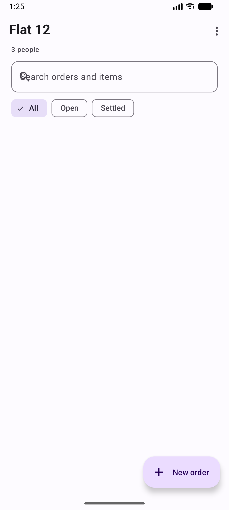
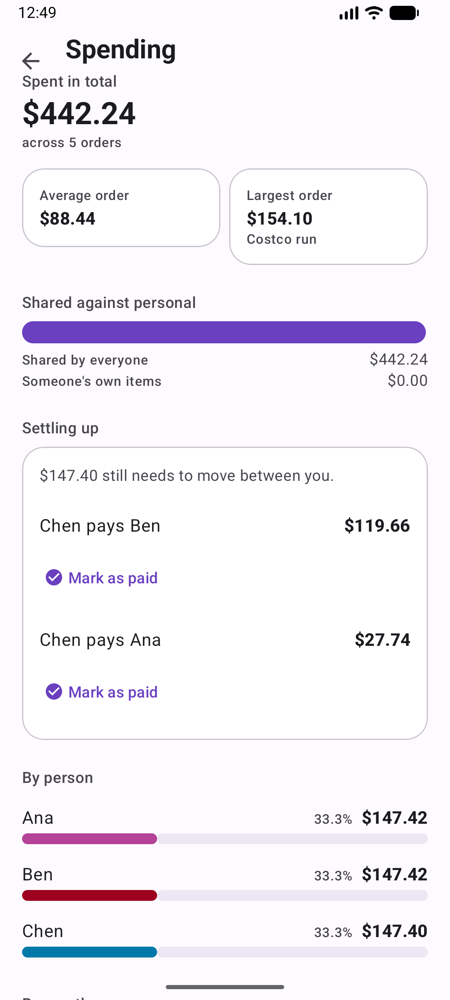
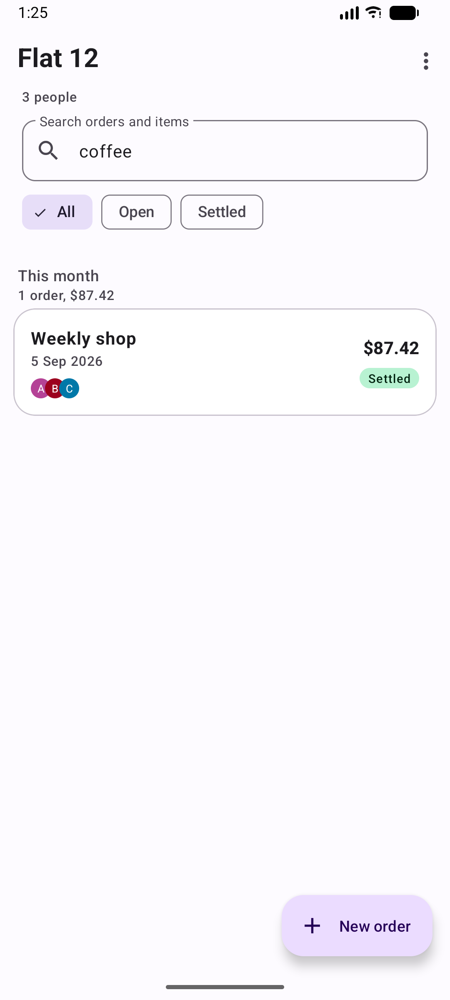
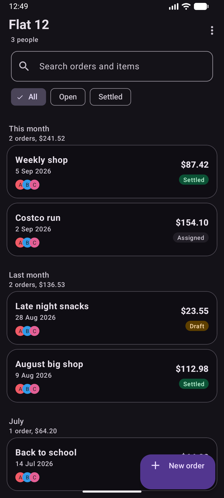
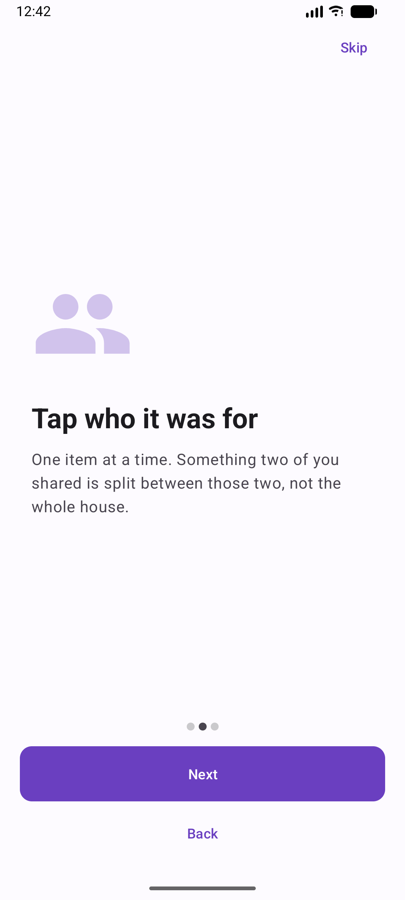
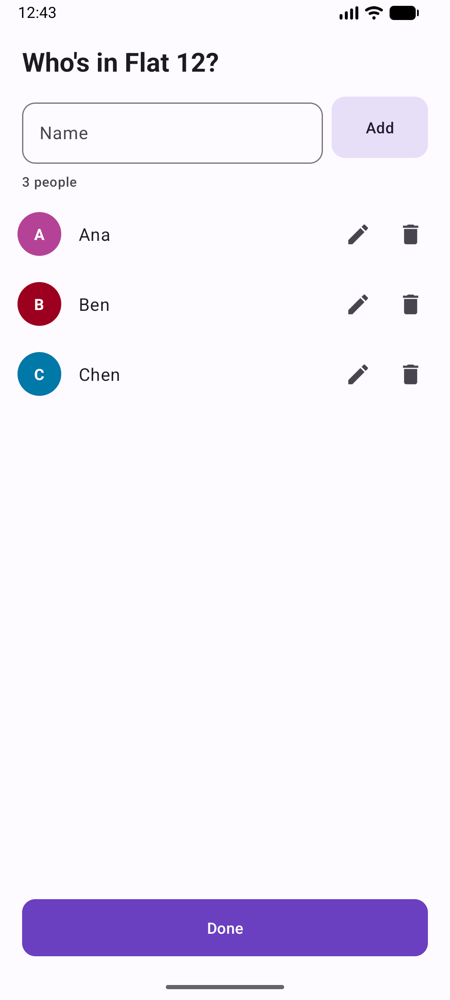
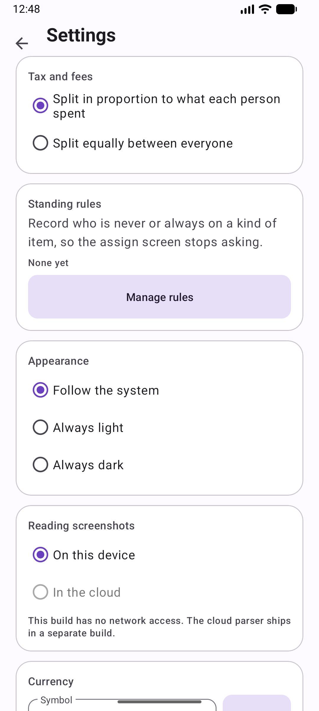

<div align="center">

# Order Splitter

**Splits a Walmart grocery order between the people you live with, and tells each person exactly what they owe.**

Screenshot the order page, share it into the app, say who each item was for, and get per-person totals that add up to the printed bill to the penny.

<p>
  
  
  
</p>
<p>
  
  
  
  
</p>

</div>

<br />

<div align="center">
  
  
  
  
</div>

---

## The problem

One person pays for the shop. Everyone owes a different amount, because half the items were not for everyone.

Doing that in a spreadsheet means typing every item, then typing the shared ones once per sharer, then reconciling by hand and discovering you are eleven cents out. The item shared by *some* of the household is the part that makes it tedious, and it is the part this app exists to remove.

## How it works

```
   Walmart app                          Order Splitter
  ┌────────────┐   share    ┌────────────────────────────────────────────┐
  │ order page │ ─────────► │  ML Kit text recognition, on device,       │
  └────────────┘            │  bundled model, no network                 │
                            │                    │                       │
                            │                    ▼                       │
                            │  layout parser                             │
                            │   • groups each price with its whole       │
                            │     wrapped name, not the line beside it   │
                            │   • drops the app bar, cart and buttons    │
                            │   • takes the charged price, never the     │
                            │     struck-through original                │
                            │                    │                       │
                            │                    ▼                       │
                            │  review: fix anything, and see the row     │
                            │  ringed on the screenshot it came from     │
                            │                    │                       │
                            │                    ▼                       │
                            │  assign: one item at a time, who was       │
                            │  this for?                                 │
                            │                    │                       │
                            │                    ▼                       │
                            │  split: largest remainder over long        │
                            │  cents, asserted to sum exactly            │
                            └────────────────────────────────────────────┘
                                                 │
                                                 ▼
                         per-person totals  ·  an Excel sheet per order
                         CSV  ·  spending analytics  ·  balances widget
```

## Correctness

This is an app about money, so the guarantees matter more than the feature list.

| Guarantee | How it is enforced |
|---|---|
| Totals add up exactly | Largest remainder with an ascending-index tie break, and an asserted postcondition that the parts sum to the input |
| No floating point near money | Every amount is `long` cents. No `float` or `double` token appears anywhere in `:core`, which is stricter than the money path alone |
| The money path cannot import Android | `:core` is a plain `java-library`, so `android.*` is not on its compile classpath. The build enforces it, not code review |
| Nothing depends on a capture's size | Parser geometry is integer permille of the image, so a 1080-wide screenshot and a 1440-wide one measure the same |
| No data loss on upgrade | Room with hand-written migrations across four versions, each tested individually, and no destructive fallback |
| The app knows nothing about groceries | No seeded item knowledge at all. Every suggestion comes from assignments this household confirmed itself |
| Colour is measured, not judged | Every theme pair clears 4.5:1 in light and dark, and both member palettes pass the categorical-palette checks for lightness, chroma, colour-vision separation and contrast |
| It cannot phone home | The default build declares no `INTERNET` permission, verified with `aapt` in a test |

### The reader is honest about what it could not read

A parser that quietly drops a charge produces a total that is short, with nothing to point at. So:

- a row whose name failed to recognise is **kept and flagged**, and the review screen will not let you leave until you have typed what it was
- a second amount that might be a struck-through original is removed **only when the arithmetic proves it**, by matching the savings the row itself prints. `4.44 - 3.24 = 1.20`, and the row says "$1.20 from savings". When nothing proves it, the charge stays, flagged
- the reconciliation against the printed total is **advisory** and never blocks you, because Walmart occasionally prints figures its own line items cannot reproduce

## Features

<table>
<tr>
<td width="33%" valign="top">

### Reading
- Share, pick, or photograph screenshots
- On-device OCR with a bundled model
- Multi-screenshot stitching, de-duplicated
- Add more screenshots to an order later
- See the exact region a row came from, ringed in red
- Duplicate-order guard by order number

</td>
<td width="33%" valign="top">

### Splitting
- Shared by everyone, by a subset, or one person
- Double shares for uneven use
- Split a multi-quantity row into separate rows
- Standing rules, for example "Ben is never on beer"
- Answers remembered from your own history
- Bulk assign, and jump to any item
- Remove a row even after assigning it

</td>
<td width="33%" valign="top">

### Keeping
- Excel workbook, a sheet per order, kept current
- CSV export and a shareable text summary
- Spending analytics and settle-up
- Balances home-screen widget
- Dated rotating backups, JSON, on device
- Light, dark, or follow the system

</td>
</tr>
</table>

## Quick start

Requires **JDK 17 or newer**. The JDK bundled with Android Studio works.

```bash
export JAVA_HOME="/Applications/Android Studio.app/Contents/jbr/Contents/Home"
./gradlew :app:installStandardDebug
```

Two product flavours:

| Flavour | Parser | Network |
|---|---|---|
| **`standard`** (default) | on-device ML Kit | no `INTERNET` permission at all |
| `cloud` | optional LLM parser, opt-in in Settings | declares `INTERNET` |

<details>
<summary><b>Running the tests</b></summary>

<br />

```bash
./gradlew :core:test                                # 204 JVM tests, no device needed
./gradlew :app:connectedStandardDebugAndroidTest    # 135 on a device or emulator
```

Turn device animations off first, which is Espresso's documented setup step. With them on, `closeSoftKeyboard` intermittently throws instead of typing:

```bash
adb shell settings put global window_animation_scale 0
adb shell settings put global transition_animation_scale 0
adb shell settings put global animator_duration_scale 0
```

The instrumented set includes the happy path from a share intent through parsing to a computed summary, and an on-device parse of three real order screenshots that also proves text recognition works with no network permission at all.

Note that `connectedAndroidTest` uninstalls the app when it finishes, which takes your data with it. That is the test runner, not a bug.

If Gradle cannot find the SDK, create `local.properties` with `sdk.dir=/path/to/Android/sdk`. That file is deliberately not committed.

</details>

<details>
<summary><b>Project layout</b></summary>

<br />

```
core/                    pure Java, no android.* on the compile classpath
  money/                 long cents, largest-remainder splitter, currency format
  calc/                  the order calculation, in the specified order
  parse/                 layout parser, Walmart behind a LayoutParser interface
  analytics/             spending and balances
  export/                XLSX written by hand from java.util.zip
  browse/                search matching and month bucketing
  backup/                backup naming and rotation
  suggest/               standing-rule matching

app/                     Android, deliberately thin
  data/                  Room entities, DAOs, migrations, repositories
  parse/                 ML Kit, and the bridge into the pure parser
  ui/                    one Activity, one nav graph, fragments with no logic
  widget/                the balances app widget
  export/ backup/ suggest/ prefs/
```

Two Gradle modules. `:core` is a plain `java-library`, so an `android.*` import there cannot compile. That is how "plain Java, runs under JUnit on the JVM" ends up enforced by the compiler rather than by review. `:app` holds Room, ML Kit and a single Activity hosting Fragments in one Navigation graph, wired Fragment to ViewModel to Repository to DAO with LiveData between.

There is no Kotlin source anywhere. The Gradle scripts are KTS because the build brief requires the Kotlin DSL, and build scripts never ship in the APK.

</details>

<details>
<summary><b>How the split works, step by step</b></summary>

<br />

All money is `long` cents. No `float` or `double` appears anywhere in `:core`, not merely in the money path, and the test suite asserts that too.

Sharing an amount uses the **largest remainder method**. Each share starts as the truncated integer quotient, the leftover cents go one each to the shares with the largest fractional remainders, and ties break by ascending index so the same input always produces the same output. `MoneySplitter` then asserts its own postcondition: the parts sum to the whole, exactly, or it throws.

An order is calculated in a fixed order, because each step's rounding depends on the one before it:

1. Excluded rows drop out, and any row nobody has answered for stops the calculation and is reported back so the summary can list it.
2. The common bucket is the sum of the common rows, less any discount. It may go negative, which is legal.
3. The bucket is split equally across the participants.
4. Each subset or personal row is split across its own assignees, weighted by their share counts, so a double share takes twice as much.
5. Tax, then delivery, then tip, then other fees are allocated in that order, weighted by each member's pre-tax total. A zero adjustment is skipped. If the weights cannot be used, because the pre-tax total is zero or a discount pushed someone negative, the allocation falls back to an equal split and says so on screen rather than hiding it.
6. The result carries the computed total and its delta against the total printed on the bill. A mismatch is reported, never silently corrected.

A person's total may land a cent away from a spreadsheet that used floating point. That is expected and correct. What may not vary is the sum: the members' totals always add up to the pre-tax total plus every adjustment, and that is asserted in code.

</details>

<details>
<summary><b>Reading the screenshots</b></summary>

<br />

See [`PARSING.md`](PARSING.md) for the row-grouping algorithm and the chrome filter. That is the file to edit when Walmart changes its layout.

The short version: text recognition runs on device, and the layout logic that turns recognised boxes into rows is pure Java, so it is tested against fixtures traced off real screenshots with no images and no device involved.

The thing that breaks naive parsers: a Walmart name wraps over two to four lines with the price right-aligned against the **first** of them. Pairing a price with the text at its own y-coordinate captures a fragment such as "Great Value Triple Cheddar" and silently drops the rest of the name. So a block opens at a line price and runs downward until the next one, and every left-column line in between is joined into one name.

The name column has a left edge as well as a right one, because ML Kit reads the packaging inside the product thumbnail: a bag of apples otherwise contributes "GALA APPLES" to the item name.

</details>

<details>
<summary><b>The Excel workbook</b></summary>

<br />

Settings, "Excel workbook". Pick a destination file once and the app keeps it up to date on its own: settle an order and it turns up as a new sheet, with no export step to remember.

The workbook holds an overview sheet with a row per order and a column per member, then one sheet per order behind it carrying the full detail. Amounts are real numbers with a currency format, so a column sums in the spreadsheet rather than being text that looks like money.

It is written by hand from `java.util.zip`, so no spreadsheet library is involved. The whole file is rewritten rather than appended to, which is deliberate: it needs nothing to read the existing workbook, and it keeps the file a faithful picture of the database instead of an append-only log that drifts when an order is edited or deleted. An order that cannot be totalled yet, because something is still unassigned, is left out rather than written with invented numbers.

</details>

<details>
<summary><b>Spending and settling up</b></summary>

<br />

Home overflow, "Spending". Total spent, average and largest order, how much went on things everyone shared against things assigned to particular people, and a per-person breakdown in each member's own colour.

It also answers the question a single order cannot: who is actually out of pocket. One person fronts each shop, and over a run of orders those advances accumulate, so "Settling up" shows each member's net balance and the shortest list of payments that would level everyone. The balances always sum to zero, which is asserted, because money appearing or vanishing there would be money somebody is wrongly asked for.

Every figure is a sum of figures the split calculator already produced, so the analytics can never disagree with what somebody was actually asked to pay. Shares are integer permille for the same reason money is `long` cents. The bars are ordinary weighted views rather than a charting library, which keeps the dependency budget intact and means each bar carries its own content description instead of the screen being one opaque canvas.

</details>

<details>
<summary><b>Standing rules, backups, and the widget</b></summary>

<br />

**Standing rules.** "Ben is never on beer" is a fact about a household that otherwise gets re-entered on every order containing beer, so it can be written down once. Nothing is seeded: the app is forbidden from shipping opinions about which groceries are usually shared, so every keyword was typed by the household about itself. A rule is a plain case-insensitive substring rather than a pattern, because someone writing "beer" should not have to think about regular expressions. Applying one is never silent: the assign screen names who was moved and by which keyword, and touching a chip by hand hands control straight back. A rule can never empty an item, and can never add somebody who is not in on the order.

**Backups.** Pick a folder once and the app keeps a week of dated JSON backups there, one a day, written after settling an order. A file that overwrites itself is not a backup, since the failure it has to survive is a bad write, so each day is its own file and only the app's own name pattern is ever pruned: you chose a folder, not a scratch space. Pruning happens only after a successful write, so a failed backup never costs an old one too. Restore reassigns every id and rewrites the references between rows, which is what makes merging work at all: the common case is restoring your own backup into the install it came from, where every id in the file is already taken.

**The widget.** The question between shops is not "what did we spend?" but "am I square with anyone?". It shows the suggested transfers rather than net balances, because "Ben pays Ana $12.40" is an instruction and "Ben: -12.40" is a puzzle. The figures come from the same balances the Spending screen uses, so the two cannot disagree.

</details>

<details>
<summary><b>Design and accessibility</b></summary>

<br />

Spacing runs on a 4dp scale, and three qualified folders override the same names: `values-sw600dp` and `values-sw840dp` for tablets, and `values-w600dp` for any window at least 600dp wide. That last one matters because "smallest width" keys off the shorter edge, which for a phone stays around 390dp however you hold it, so a landscape phone would otherwise stretch the compact reading column across 870dp. Every screen lays its content in a column constrained to `content_max_width` and centred, so line length stays readable as the window grows, with no duplicated layouts and no size fixed to a device.

Colour is semantic and paired: `success`, `warning` and `danger` exist as container plus on-container pairs in `values/colors.xml` and its `values-night` twin, resolved at runtime. Nothing in the code carries an ARGB literal, which is what makes dark mode work at all.

Icons carry no tint of their own, so the same drawable can be reused anywhere and take its colour from where it is drawn. Every state that colour encodes also carries an icon and a word, so meaning survives for a colour blind reader and in a greyscale screenshot. Touch targets are at least 48dp. The app draws edge to edge and each screen insets itself from the real system bar heights, so no title ends up under the clock on one device and floating on another.

Dark mode is chosen rather than flipped. The member palette in particular is searched against the dark surface on its own, because lifting the light one by hue collapses distinct entries into near-duplicates: two magentas that read apart at lightness 0.45 are the same colour at 0.63.

</details>

<details>
<summary><b>Decisions worth knowing about</b></summary>

<br />

**Hand-written dependency wiring, not Hilt.** The codebase is Java only, and Hilt would add a Kotlin Gradle plugin plus a second annotation processor to a single-Activity app with a handful of repositories.

**No scheduled jobs.** Backups run on the hook the workbook already uses rather than through WorkManager, because a household's data only changes when they use the app, so there is nothing for a background wake-up to find.

**The second store is a seam, not a feature.** `LayoutParser` is the only thing above the OCR that knows what a store's page looks like, and a test proves a different store's layout flows through the domain layer unchanged. No second store ships: guessing at a layout with no real screenshots to check against is how a parser ends up silently wrong about money.

**Ten member colours in a fixed order.** A household of four uses the first four and never sees the rest, so the opening slots are separated hardest. Ten slots plus a text-contrast floor cannot clear the all-pairs colour-vision floor, which is a property of the constraints rather than of the search. It is acceptable only because colour is never the sole channel: an avatar carries initials, a bar carries a name.

**The optional cloud parser is absent from the default build.** The `standard` flavour declares no `INTERNET` permission and does not contain the cloud parser at all, so there is nothing to enable by accident. To use it, build the `cloud` flavour and add `llm.api.key=...` to `local.properties`, which is gitignored so the key is never committed. Its output goes through the same review screen as the on-device reader, and is never trusted more than it.

</details>

## Privacy

Everything stays on the device. There is no account, no server and no sync.

The default build has no network permission at all, so it cannot send anything anywhere even in principle. Screenshots are never copied into the app: only their URIs are stored, held with a persistable permission so they still open after a restart. Household names, member names and every order live in a local Room database and go nowhere else.

A fresh install contains no household, no members, no orders and no knowledge of any grocery item. Assignment suggestions come only from assignments you have confirmed yourself in this household. There is no shipped list of which products are "usually shared".

<br />

<div align="center">
  
  
  
</div>

<div align="center">
<br />
<sub>Built for one household's weekly shop. The spreadsheet it replaced is not missed.</sub>
</div>
